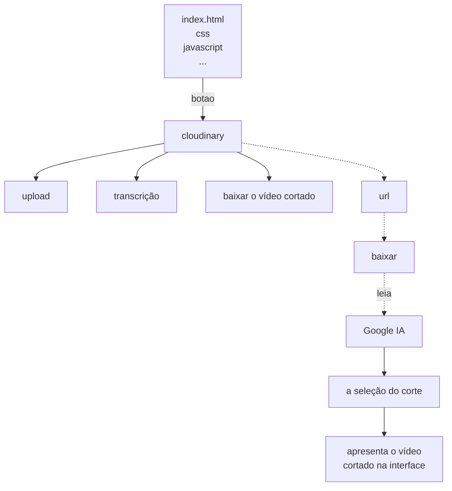

<h1 align=center> AI Clip Maker 🎞</h1>

<p align="center">
<a href="#-live-demo">Live Demo</a>&nbsp;&nbsp;&nbsp;|&nbsp;&nbsp;&nbsp;
<a href="#-screenshots">Screenshots</a>&nbsp;&nbsp;&nbsp;|&nbsp;&nbsp;&nbsp;
<a href="#-technologies">Technologies</a>&nbsp;&nbsp;&nbsp;|&nbsp;&nbsp;&nbsp;
<a href="#-features">Features</a>&nbsp;&nbsp;&nbsp;|&nbsp;&nbsp;&nbsp;
<a href="#-how-to-run">How to Run</a>&nbsp;&nbsp;&nbsp;|&nbsp;&nbsp;&nbsp;
<a href="#-license">License</a>&nbsp;&nbsp;&nbsp;|&nbsp;&nbsp;&nbsp;
<a href="#-contributing">Contributing</a>&nbsp;&nbsp;&nbsp;|&nbsp;&nbsp;&nbsp;
<a href="#support">Support</a>
</p>

<p align="center">
  
</p>

<br>

## 🌐 Live Demo

<p align="center">
  <a href="https://ai-code-analyzer-wejp.onrender.com">
    
  </a>
</p>

<p align="center">
  <sub>Tip: Use right-click → “Open in new tab”.</sub>
</p>

<br>

## 📸 Screenshots


<br>

## 🛠 Technologies

- HTML5  
- CSS3/Tailwind  
- JavaScript (Vanilla)
- Cloudinary
- Gemini
- Git and GitHub

<br>

## ✨ Features

- This system allows users to upload a video through the frontend.  
- The video is processed using Cloudinary, transcribed using AI, and analyzed to automatically select the best clips.  
- Finally, the system generates a "viral" shortened video.

<br>

## ⚙ How to Run

### 📋 Requirements

- [Git](https://git-scm.com/)
  
<br>

### 👣 Steps

1. **Clone the repository**:

   ```bash
   git clone https://github.com/Chrysthy/ai-clip-maker.git
   cd ai-clip-maker
   ```
   

2. **Open in your browser**:

   ```
   http://localhost:3030
   ```
   
### 🔐 API Configuration

This project requires a valid **Google API key** to function properly.

1. **Get your API Key**:  
   - Go to [Google Cloud Console](https://console.cloud.google.com/)
   - Create a new project (or use an existing one)
   - Generate an API key

<br>

### Architecture Overview




<br>

## 📜 License

* This project is licensed under the [MIT License](https://choosealicense.com/licenses/mit/)

<br>

## 🫱🏻‍🫲🏻 Contributing
<p> Contributions, issues, and feature requests are welcome! Please, feel free to do it! 😉 </p>

<br>

