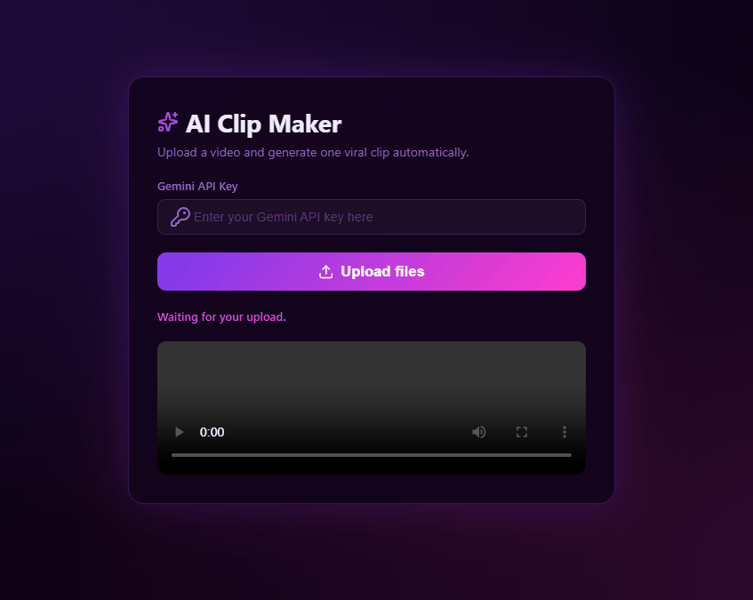

<h1 align=center> AI Clip Maker 🎞</h1>

<p align="center">
<a href="#-live-demo">Live Demo</a>&nbsp;&nbsp;&nbsp;|&nbsp;&nbsp;&nbsp;
<a href="#-screenshots">Screenshots</a>&nbsp;&nbsp;&nbsp;|&nbsp;&nbsp;&nbsp;
<a href="#-technologies">Technologies</a>&nbsp;&nbsp;&nbsp;|&nbsp;&nbsp;&nbsp;
<a href="#-features">Features</a>&nbsp;&nbsp;&nbsp;|&nbsp;&nbsp;&nbsp;
<a href="#-how-to-run">How to Run</a>&nbsp;&nbsp;&nbsp;|&nbsp;&nbsp;&nbsp;
<a href="#-license">License</a>&nbsp;&nbsp;&nbsp;|&nbsp;&nbsp;&nbsp;
<a href="#-contributing">Contributing</a>&nbsp;&nbsp;&nbsp;|&nbsp;&nbsp;&nbsp;
<a href="#support">Support</a>
</p>

<p align="center">
  
</p>

<br>

## 🌐 Live Demo

<p align="center">
  <a href="https://ai-code-analyzer-wejp.onrender.com">
    
  </a>
</p>

<p align="center">
  <sub>Tip: Use right-click → “Open in new tab”.</sub>
</p>

<br>

## 📸 Screenshots



<br>

## 🛠 Technologies

- HTML5  
- CSS3/Tailwind  
- JavaScript (Vanilla)
- Cloudinary
- Gemini
- Git and GitHub

<br>

## ✨ Features

- This system allows users to upload a video through the frontend.  
- The video is processed using Cloudinary, transcribed using AI, and analyzed to automatically select the best clips.  
- Finally, the system generates a "viral" shortened video.

<br>


## How It Works


```mermaid
flowchart TD
    User[User]
    Frontend[Frontend<br/>index.html + CSS + JavaScript]
    Cloudinary[Cloudinary<br/>Upload and storage]
    Transcription[Video Transcription]
    AI[Google AI<br/>Content analysis]
    ClipSelection[Clip Selection]
    FinalVideo[Final Edited Video]
    Download[Download]

    User --> Frontend
    Frontend -->|Upload video| Cloudinary
    Cloudinary --> Transcription
    Transcription --> AI
    AI --> ClipSelection
    ClipSelection --> FinalVideo
    FinalVideo --> Download
